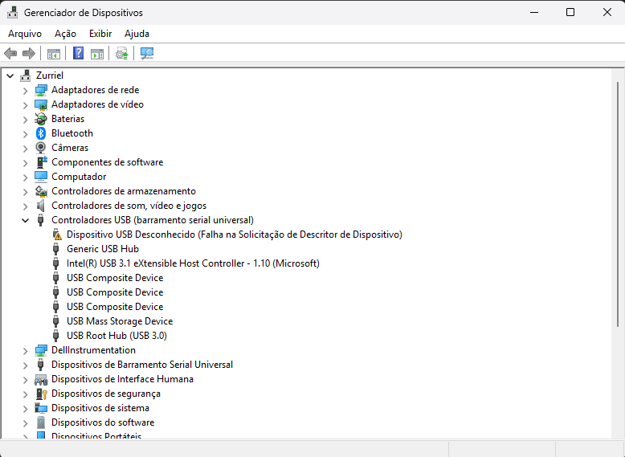
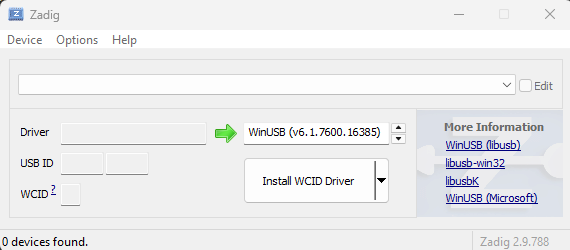
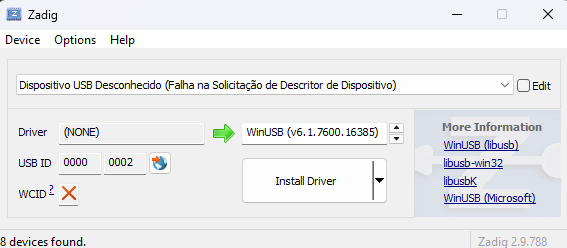

# Problem Raspberry Pi Pico W

 Describes a problem found on the Raspberry Pi Pico W, where after uploading a program, the USB interface stopped responding correctly and presented a connection error.

## Description problem

### Portuguese

Após compilação e inserção de um novo código no dispositivo, o mesmo apresentou falha na interface USB. Deixando o dispositivo impossibilitado de realizar novas gravações de programas.

#### Como ocorreu

Após compilação e teste do código no simulador Wokwi, o programa desenvolvido foi enviado para a placa (utilizando o botão RUN da Extensão do Raspberry Pi Pico no `vscode`), mas após o envio o programa não executou e a porta USB apresentou falha (Erro 43 no Windows). Após a falha na USB, o programa anteriormente existente na placa passou a ser executado e o novo não existia na mesma, pois a sua execução não poderá ser visualizada.

A placa continua entrando em modo `BOOTSEL`, mas a unidade `RPI-PR2` não pode ser visualizada no computador.

### Verificações

Após a falha, algumas verificações foram feitas, sendo elas:

1. Verificação se o dispositivo era existente no gerenciador de dispositivos;
2. Verificação se o dispositivo aparece no Zadig
3. Verificação se o dispositivo apresentava a mesma falha com outro cabo USB
4. Verificação se o dispositivo apresentava a mesma falha em outro sistema operacional

#### Primeira verificação

Após a falha e verificando que a placa ainda permitia entrar em modo `BOOTSEL`, foi verificado como o mesmo aparecia no **Gerenciador de Dispositivos**, sendo detectado o visualizado na imagem abaixo.



Sendo possível verificar que o dispositivo aparece com falha: **Falha na Solicitação de Descritor de Dispositivo**.


Note que, independente de estar ou não em modo `BOOTSEL`, a placa mantém o mesmo comportamento, onde apresenta falha ao conectar o dispositivo ao computador via USB.

#### Segunda verificação

A segunda verificação pensada, foi utilizar o Zadig para ver como o dispositivo aparecia no mesmo. Contudo, foi observado que o dispositivo tinha a mesma apresentação que o gerenciador de dispositivos. Assim como pode ser visto nas imagens abaixo.



Após listagem de todos os dispositivos:



#### Terceira verificação

Após a verificação e consulta de resolução do problema, algumas verificações tiveram de ser feitas. Sendo uma muito importante a verificação do cabo USB, e ao utilizar outro cabo USB, o dispositivo apresentava a mesma falha. Sendo então descartado falha ou problema no cabo USB.


Além dessa verificação, uma outra verificação é sugerida, como: realizar conexão em outra porta USB_, e esta ação foi realizada, mas **sem sucesso**.

#### Quarta verificação

No caso do Linux, ao realizar conexão da placa no computador e com o uso da ferramenta dmesg é possível detectar o seguinte erro:

```bash
[  796.728904] usb 1-3: new full-speed USB device number 26 using xhci_hcd
[  796.845947] usb 1-3: device descriptor read/64, error -71
[  797.067901] usb 1-3: device descriptor read/64, error -71
[  797.288270] usb 1-3: new full-speed USB device number 27 using xhci_hcd
[  797.403975] usb 1-3: device descriptor read/64, error -71
[  797.625983] usb 1-3: device descriptor read/64, error -71
[  797.734084] usb usb1-port3: attempt power cycle
[  798.124893] usb 1-3: new full-speed USB device number 28 using xhci_hcd
[  798.125064] usb 1-3: Device not responding to setup address.
[  798.335675] usb 1-3: Device not responding to setup address.
[  798.541913] usb 1-3: device not accepting address 28, error -71
[  798.542022] usb 1-3: WARN: invalid context state for evaluate context command.
[  798.655902] usb 1-3: new full-speed USB device number 29 using xhci_hcd
[  798.656061] usb 1-3: Device not responding to setup address.
[  798.862041] usb 1-3: Device not responding to setup address.
[  799.069905] usb 1-3: device not accepting address 29, error -71
[  799.070378] usb 1-3: WARN: invalid context state for evaluate context command.
[  799.070483] usb usb1-port3: unable to enumerate USB device
```

## O que foi entendido

Nos fóruns e os relatos de problemas similares, bastava realizar a operação de segurar o `BOOTSEL` ou segurar o Reset (`RUN`) + `BOOTSEL` e logo após isso realizar conexão do cabo USB no computador e isso bastava para resolver o problema, contudo não obtive sucesso.

Podendo ser verificado neste link: https://forums.raspberrypi.com/viewtopic.php?p=2266706&hilit=Raspberry+Pi+Pico+W+Unknown+USB+Device#p2266706


## Última solução encontrada (Não testada)

Como uso do Chatgpt, para encontrar uma solução. Uma solução possível foi apresentada, sendo ela:


### Indicativos de persistência do problema

Indícios de que o problema persiste:
Unidade RPI-RP2 não aparece: Mesmo após tentar entrar no modo BOOTSEL, o dispositivo não é reconhecido pelo sistema operacional.
Mensagens de erro contínuas: Erros como "error 43" no Windows ou mensagens de falha no dmesg do Linux continuam a ocorrer.
LEDs indicativos: Os LEDs do Pico W podem não acender ou mostrar um comportamento anômalo.

### Descrição da solução proposta

A informação sobre forçar o modo `BOOTSEL` com hardware não está documentada oficialmente na página oficial da Raspberry Pi, mas é baseada em experiências da comunidade, como discussões nos fóruns do Raspberry Pi, GitHub e experimentação prática. A ideia é resetar o microcontrolador manualmente para que ele entre no modo de recuperação.

#### Passos detalhados para forçar o modo `BOOTSEL` via Hardware


1. Desconecte qualquer fonte de energia
   - Se o Raspberry Pi Pico W estiver conectado ao computador via USB ou a uma bateria, remova todas as conexões de energia antes de começar.
2. Criar um curto temporário entre o pino `RUN` e `GND`
   - Com o Pico W sem energia, conecte temporariamente o pino `RUN` (pino 30) ao `GND` (pino 3 ou qualquer outro pino GND disponível na placa) usando um jumper, um fio ou até mesmo uma pinça metálica.
   - ⚠️ Não reconecte a energia ainda!
3. Pressionar e segurar o botão `BOOTSEL`
   - Mantenha pressionado o botão `BOOTSEL` enquanto o curto entre `RUN` e `GND` ainda está conectado.
4. Reconectar a energia (USB)
   - Com o `BOOTSEL` ainda pressionado e o curto entre `RUN` e `GND` mantido:
        - Reconecte o Raspberry Pi Pico W ao computador via cabo USB.
        - Se estiver usando bateria, reconecte a alimentação.
5. Soltar `RUN` → GND primeiro
   - Agora, remova a conexão entre `RUN` e `GND` primeiro.
   - Importante: O botão `BOOTSEL` ainda deve estar pressionado!
6. Soltar o botão `BOOTSEL`
   - Depois de remover o curto `RUN` → `GND`, solte o botão `BOOTSEL`.
7. Verificar se a unidade RPI-RP2 apareceu
   - No Windows, abra o Explorador de Arquivos e veja se a unidade `RPI-RP2` aparece.
   - No Linux, use o comando:

        ```bash
        lsblk
        ```

        Ou veja os logs com:

        ```bash
        dmesg | tail -n 20
        ```

Se a unidade `RPI-RP2` aparecer, copie o arquivo `.uf2` para ela.

#### Explicação do Processo

O pino `RUN` é responsável por reiniciar o microcontrolador RP2040. Criando um curto entre `RUN` e `GND`, você força o chip a resetar.
Manter `BOOTSEL` pressionado durante esse reset força o chip a entrar no modo USB de recuperação (`RPI-RP2`), mesmo que o firmware anterior esteja corrompido.
O procedimento é seguro e apenas reinicializa o RP2040 sem riscos de dano.
